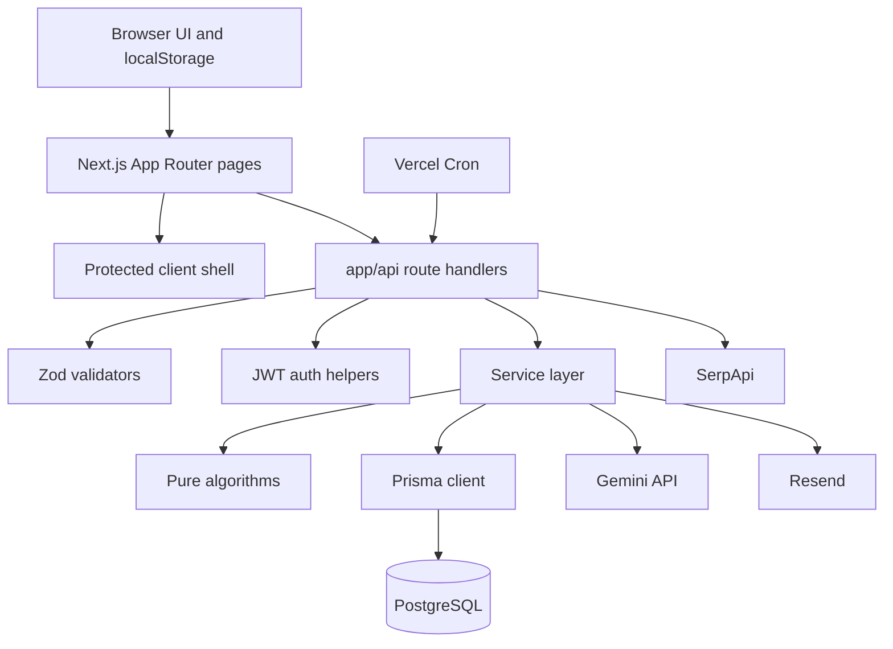
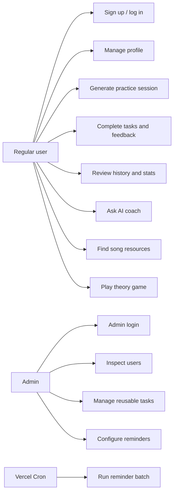
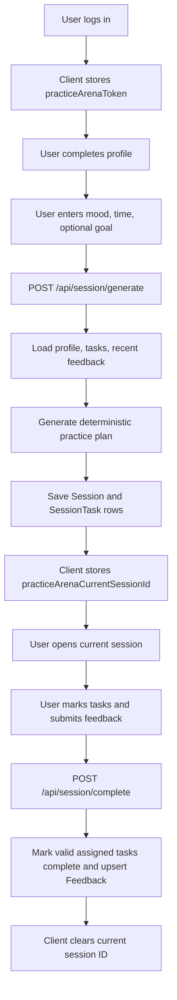
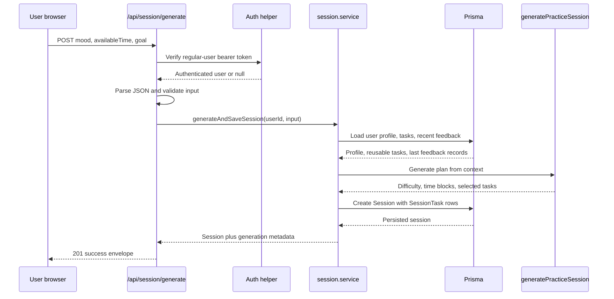
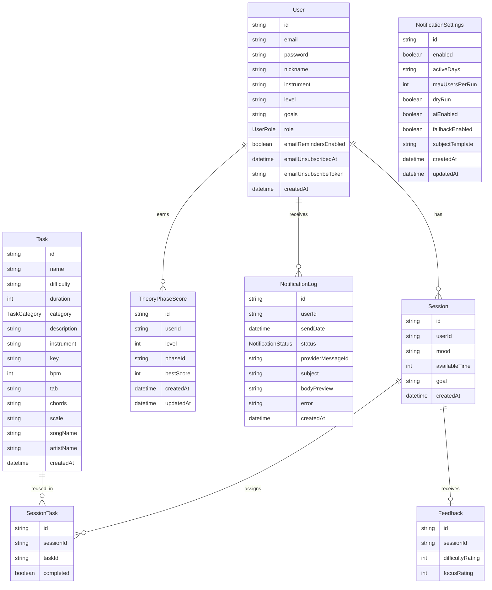
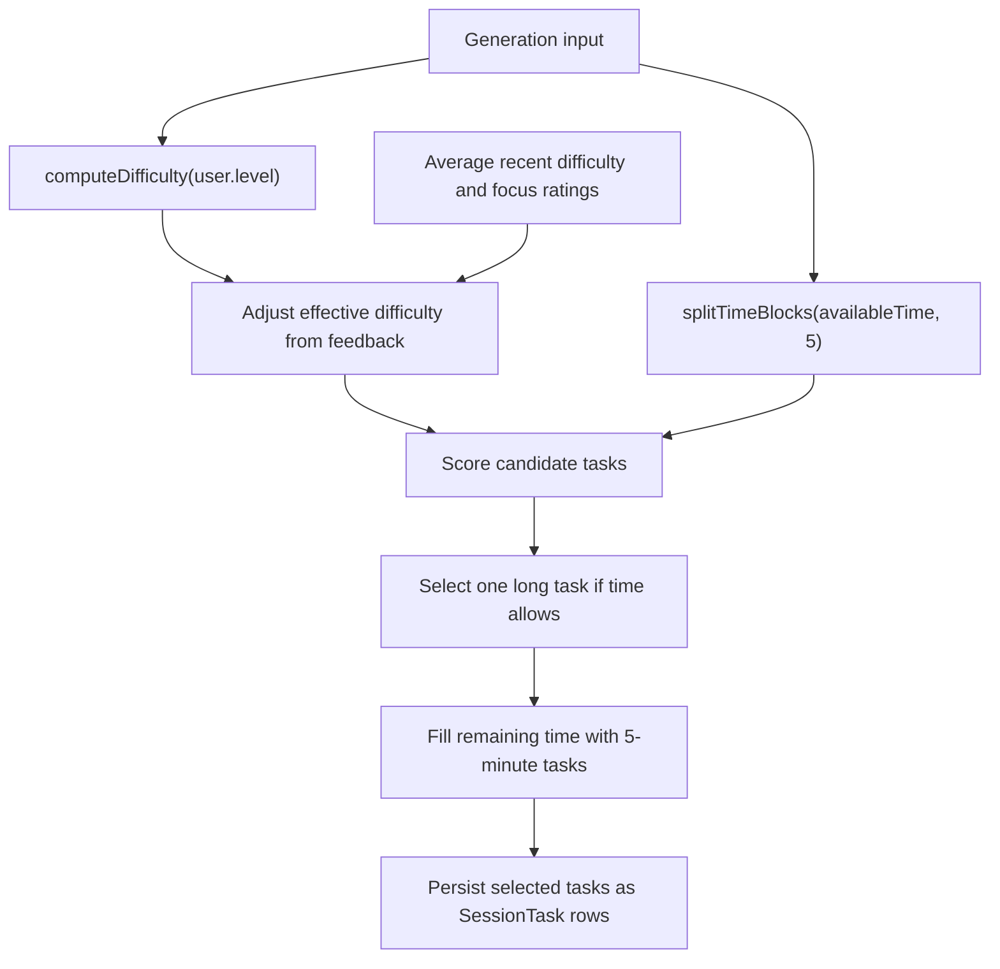

# Corrected Detailed Design - Practice Arena

Version: current implementation design  
Project type: Academic final project and implementation handoff  
Primary sources: `README.md`, `prisma/schema.prisma`, `docs/architecture-routing.md`, `services/*.service.ts`, `algorithms/*.ts`, `lib/*.ts`, `lib/theory-game/*`, and `app/api/**/route.ts`

## 1. Project Scope and Goals

Practice Arena is a web-based music practice planning application focused on guitar practice. The system helps a user create a profile, generate personalized practice sessions, complete assigned tasks, review progress, ask an AI music coach for guidance, find song-learning resources, and train interval recognition through a music theory game.

The corrected design reflects the actual implemented application. The system is built as a Next.js App Router application with TypeScript, Prisma, PostgreSQL, browser-based client interactions, server-side API route handlers, and a layered service/algorithm design.

### Main Goals

- Personalize guitar practice sessions using user level, mood, available time, session goals, saved goals, reusable tasks, and recent feedback.
- Track practice history, assigned tasks, completed tasks, and focus/difficulty ratings.
- Provide music-practice assistance through a Gemini-powered coach that uses the user's saved Practice Arena context.
- Provide song-learning support by searching for tablature and listening resources.
- Provide interval ear-training through a structured five-level theory game.
- Provide an admin dashboard for inspecting users, viewing sessions, managing reusable task content, and configuring daily email reminders.
- Keep backend data access, validation, authentication, and algorithms separated into maintainable layers.

### Current Scope Boundaries

- The practice-planning feature currently supports guitar only.
- Authentication uses JWT bearer tokens stored in browser localStorage.
- Protected UI pages are guarded by a client-side shell; API routes independently verify bearer tokens.
- Practice-session content is selected from reusable tasks stored in PostgreSQL.
- Theory-game rounds are generated in the browser, while the server validates the submitted phase and derives the stored score.

## 2. Requirements

### Functional Requirements

| Area | Requirement |
| --- | --- |
| Authentication | Users can sign up, log in, and receive a seven-day JWT. |
| Profile | Users can view and update nickname, guitar instrument, level, and goals. |
| Practice generation | Users can request a practice session using mood, available time, and optional session goal. |
| Current session | Users can complete assigned tasks and submit difficulty/focus feedback. |
| History and statistics | Users can view previous sessions, task completion state, average ratings, and completion rate. |
| AI coach | Users can ask music-practice questions and receive context-aware Gemini responses. |
| Song learner | Users can search for tablature/listening resources and receive a basic learning guide. |
| Theory game | Users can play interval-recognition phases and save best phase scores. |
| Admin login | Admins authenticate separately from normal users. |
| Admin dashboard | Admins can inspect regular users, user session details, reusable tasks, and notification settings. |
| Task inventory | Admins can create reusable practice tasks with music metadata. |
| Daily reminders | Admins can configure reminder settings, run dry-run/live reminder batches, and send test reminders. |
| Unsubscribe | Users can disable reminder emails through a tokenized unsubscribe link. |

### Non-Functional Requirements

| Quality Attribute | Design Response |
| --- | --- |
| Maintainability | UI, API handlers, services, algorithms, validators, and client helpers are separated by responsibility. |
| Reliability | API routes validate JSON and input shape before calling service logic. |
| Security | Server APIs verify JWTs and user roles before protected operations. |
| Privacy | Passwords are hashed and safe user selectors avoid returning password hashes. |
| Testability | Practice generation, theory rules, and notification rules are implemented as testable functions. |
| Deployability | The app is deployable as a Next.js application with Prisma, PostgreSQL, Vercel Cron, and environment-based integrations. |
| Extensibility | Reusable tasks, service layers, and generated theory definitions allow features to grow without changing UI routes directly. |

## 3. Technology Stack

| Layer | Current Technology |
| --- | --- |
| Application framework | Next.js 16 App Router |
| UI runtime | React 19 with TypeScript |
| Styling | Global CSS and reusable app UI components |
| Server runtime | Next.js API route handlers |
| Database ORM | Prisma 7 |
| Database | PostgreSQL |
| Authentication | JWT signed with `JWT_SECRET` |
| Password hashing | `bcryptjs` |
| Validation | Zod schemas in `lib/validators.ts` |
| AI coach | Gemini API with configured primary and fallback models |
| Song search | SerpApi Google search |
| Email delivery | Resend |
| Scheduled jobs | Vercel Cron calling `/api/cron/daily-reminders` |
| Deployment target | Vercel |
| Tests | Node test runner with `tsx` imports |

## 4. High-Level Architecture

Practice Arena uses a layered architecture. UI pages and client hooks handle browser state and interaction. API route handlers handle transport concerns such as authentication, JSON parsing, validation, and response mapping. Services coordinate business logic and Prisma queries. Pure algorithm modules handle deterministic practice-session and theory-game logic.



### Architectural Responsibilities

| Layer | Responsibility |
| --- | --- |
| `app/**/page.tsx` | Render UI, hold page state, call browser API clients, and perform client redirects. |
| `app/(protected)/protected-shell.tsx` | Protect regular-user pages by checking localStorage token and profile validity. |
| `app/api/**/route.ts` | Authenticate, parse JSON, validate payloads, call services, return API envelopes. |
| `services/*.service.ts` | Coordinate business rules, Prisma queries, external APIs, and result shaping. |
| `algorithms/*.ts` | Implement pure practice-session calculation and selection logic. |
| `lib/theory-game/*` | Define theory curriculum, progress composition, scoring, and note-pair generation. |
| `lib/client/*` | Store tokens/current-session IDs, call APIs, manage local theory progress, and play piano samples. |
| `prisma/schema.prisma` | Define the relational data model and source of truth for stored data. |

## 5. Route and Module Ownership

### UI Routes

| Route | Purpose |
| --- | --- |
| `/` | Profile-aware redirect to auth, profile, or session creation. |
| `/auth` | Regular user login and signup. |
| `/profile` | View/edit profile and show practice statistics. |
| `/session/new` | Create a new practice session request. |
| `/session/current` | Load current session ID from localStorage and complete tasks. |
| `/history` | Display session history and aggregate statistics. |
| `/coach` | Gemini-powered music practice coach. |
| `/song-learner` | Search for song-learning resources. |
| `/theory-game` | Ear-training interval game. |
| `/admin/login` | Admin login. |
| `/admin` | Admin dashboard. |

### API Groups

| API Group | Routes |
| --- | --- |
| Authentication | `POST /api/auth/signup`, `POST /api/auth/login` |
| Profile | `GET /api/profile`, `POST /api/profile` |
| Sessions | `POST /api/session/generate`, `POST /api/session/complete`, `GET /api/session/history`, `GET /api/session/stats` |
| Coach and song learning | `POST /api/chat`, `POST /api/song-learner` |
| Theory game | `GET /api/theory-game/progress`, `POST /api/theory-game/scores` |
| Admin | `POST /api/admin/auth/login`, `GET /api/admin/users`, `GET /api/admin/users/[userId]`, `GET /api/admin/tasks`, `POST /api/admin/tasks` |
| Notifications | `GET /api/admin/notifications`, `POST /api/admin/notifications`, `POST /api/admin/notifications/test`, `GET /api/cron/daily-reminders`, `GET /api/notifications/unsubscribe` |
| Utility | `GET /api/test` |

All regular protected endpoints require a regular-user bearer token. Admin endpoints require an admin-role bearer token except the admin login endpoint. Cron processing requires `Authorization: Bearer <CRON_SECRET>`.

## 6. Main User Flows

### 6.1 Use-Case Diagram



### 6.2 Practice Session Flow



### 6.3 Session Generation Sequence



## 7. Feature and Module Design

### 7.1 Authentication and Profile

Regular user signup and login are implemented through `POST /api/auth/signup` and `POST /api/auth/login`. Input is validated by Zod schemas. Passwords are hashed with bcrypt before storage. Login checks that the target user has role `user`, compares the password hash, and returns a JWT plus a safe user object.

The JWT is signed with `JWT_SECRET` and expires after seven days. The client stores the regular user token under `practiceArenaToken`. Profile APIs use the regular-user token and expose safe user fields only.

Profile updates support nickname, guitar instrument, level, and goals. The validator currently accepts only `guitar` as the instrument, which matches the project scope.

### 7.2 Practice Session Generation

The practice-session module is split between:

- `app/api/session/generate/route.ts` for transport behavior.
- `services/session.service.ts` for database orchestration.
- `algorithms/generatePracticeSession.ts`, `computeDifficulty.ts`, `splitTimeBlocks.ts`, and `selectTasks.ts` for pure recommendation logic.

The service loads the user's level/goals, all reusable tasks, and up to five most recent feedback records. It computes feedback averages and passes the context to the pure generator. The generated tasks are persisted as a `Session` with related `SessionTask` rows.

### 7.3 Current Session Completion and Feedback

The current-session page reads the current session ID from `practiceArenaCurrentSessionId` in localStorage. It loads the user's history and locates the matching session client-side.

When the user submits completion data, `POST /api/session/complete` verifies ownership through the service layer. Only task IDs that belong to the target session are marked complete. Feedback is saved with an upsert so each session has one difficulty/focus rating pair.

### 7.4 History and Statistics

`GET /api/session/history` returns sessions newest first, including tasks and feedback. `GET /api/session/stats` returns:

- Number of sessions.
- Average focus rating.
- Average difficulty rating.
- Task completion rate.

The statistics are calculated with Prisma counts and aggregate queries.

### 7.5 AI Coach

The AI coach is implemented in `services/chat.service.ts` and called through `POST /api/chat`. The service builds a Practice Arena context block containing:

- User nickname, email, instrument, level, and goals.
- Aggregate session statistics.
- Up to five recent sessions with mood, time, goal, feedback, tasks, and completion state.

The service sends the conversation and system instruction to Gemini. A primary model can be configured with `GEMINI_MODEL`; fallback models are configured with `GEMINI_FALLBACK_MODELS` or default to the built-in fallback list. The output limit is controlled by `GEMINI_MAX_OUTPUT_TOKENS` and clamped to a safe range.

The coach is intentionally scoped to music, guitar technique, practice planning, exercises, songs, theory, profile data, saved sessions, tasks, feedback, and progress.

### 7.6 Song Learner

The song learner is implemented in `POST /api/song-learner`. It validates title and optional artist, builds two Google-search queries, and uses SerpApi to search in parallel:

- A tablature query targeting Ultimate Guitar results.
- A listening query targeting YouTube results.

If a preferred result is not found, the API returns a Google search fallback URL. The response also includes a deterministic learning guide that tells the user how to approach the song.

### 7.7 Music Theory Interval Game

The theory game is a client-interactive feature at `/theory-game`. Static curriculum definitions live in `lib/theory-game/definitions.ts`; progress composition lives in `lib/theory-game/progress.ts`; note-pair and sample-path logic lives in `lib/theory-game/rounds.ts`.

The game uses bundled piano samples from MIDI 48 through 96. The user plays phases containing interval-identification rounds. At the end of a phase, the client submits the number of correct answers, not a client-calculated score. The server validates the level and phase ID and derives the score from server-side definitions.

Best scores are stored in `TheoryPhaseScore` with a unique `(userId, level, phaseId)` constraint. Later lower scores do not overwrite higher scores.

### 7.8 Admin Dashboard

Admin authentication uses the same JWT format but a separate browser storage key, `practiceArenaAdminToken`, and role checks require `role = admin`. Admin APIs verify the token and role independently.

Admin dashboard capabilities include:

- List regular users newest first with derived session/task/feedback counts.
- Load one user's profile, sessions, assigned tasks, completion state, and feedback.
- List reusable tasks newest first.
- Create reusable tasks with validated music metadata.
- Read and update notification settings.
- Generate or send a test reminder email to the authenticated admin.

Current admin behavior is intentionally limited: it does not edit/delete users, sessions, feedback, or existing tasks.

### 7.9 Daily Email Reminders

Notification behavior is implemented in `services/notification.service.ts` and `lib/notification-rules.ts`. Settings are stored in a singleton `NotificationSettings` row with ID `global`.

The daily cron endpoint:

1. Verifies `Authorization: Bearer <CRON_SECRET>`.
2. Reads settings, creating the default settings row if needed.
3. Checks enabled state and active UTC weekday.
4. Selects eligible regular users who remain subscribed and have no log for the current send date.
5. Generates AI content through Gemini when enabled and available.
6. Falls back to deterministic reminder text when fallback generation is enabled.
7. Records `NotificationLog` rows.
8. Sends through Resend only when dry-run mode is disabled.

The unsubscribe endpoint disables reminders for the user identified by a valid unsubscribe token and returns a simple HTML confirmation page.

## 8. Data Model Design

`prisma/schema.prisma` is the source of truth for the stored data model.



### Entity Summary

| Entity | Purpose |
| --- | --- |
| `User` | Stores identity, password hash, profile fields, role, and reminder subscription state. |
| `Session` | Stores one generated practice session request and its user context. |
| `Task` | Stores reusable practice content and music metadata. |
| `SessionTask` | Connects sessions to reusable tasks and tracks completion. |
| `Feedback` | Stores one difficulty/focus rating pair for a session. |
| `TheoryPhaseScore` | Stores best score per user, level, and stable phase ID. |
| `NotificationSettings` | Stores global reminder processing configuration. |
| `NotificationLog` | Stores one reminder processing result per user and UTC send date. |

## 9. Recommendation Algorithm Design

The practice recommendation engine is deterministic and rule-based. It uses reusable tasks from the database and ranks them according to the current user/session context.

### Inputs

- User level: `beginner`, `intermediate`, or `advanced`.
- Available time: 5 to 240 minutes.
- Mood text.
- Optional session goal.
- Saved profile goals.
- Recent feedback summary from up to five feedback records.
- Reusable task pool.

### Processing Steps



### Difficulty Rules

`computeDifficulty` maps the user's profile level directly:

| User level | Base target difficulty |
| --- | --- |
| `beginner` | `beginner` |
| `intermediate` | `intermediate` |
| `advanced` | `advanced` |

Recent difficulty feedback can shift the effective target:

- Average difficulty rating `>= 4`: shift one level easier.
- Average difficulty rating `<= 2`: shift one level harder.
- Otherwise, keep the base difficulty.

### Time Allocation

`splitTimeBlocks` divides available time into 5-minute blocks. If available time is less than 5 minutes, no blocks are returned. The public validator requires 5 to 240 minutes, so normal session generation always has at least one block.

Task selection uses total available block minutes. It first attempts to select one task of at least 10 minutes when enough time exists. It then fills remaining time with tasks whose duration is exactly 5 minutes.

### Task Scoring

Each candidate task receives a score from several factors:

| Factor | Rule |
| --- | --- |
| Difficulty exact match | `+60` |
| Difficulty one level away | `+25` |
| Difficulty two levels away | `-20` |
| Low-energy mood with simple task category | `+25` |
| Low-energy mood with other category | `-10` |
| High-energy mood with technique/scale/solo/riff | `+25` |
| Session goal category match | `+85` |
| Profile goal category match | `+35` |
| Goal word appears in task text | `+4` per matching word |
| Low focus feedback with simple category | `+20` |
| Different category from previous selected task | `+5` |

Low-energy moods include words such as tired, stressed, anxious, low, unfocused, exhausted, overwhelmed, and sad. High-energy moods include focused, motivated, energetic, excited, confident, happy, and ready.

Simple categories are chord, song chord, and rhythm tasks. High-energy categories are technique, scale, solo, and riff tasks.

Tie-breakers are deterministic: higher score wins, category variation is preferred, shorter duration wins, then task name and ID order are used.

## 10. Theory Game Design

The theory game trains interval recognition from unison through octave. The hierarchy is:

```text
Level
  Phase
    Round
```

### Interval Bank

The game covers 13 chromatic intervals:

| ID | Label | Semitones |
| --- | --- | ---: |
| `p1` | Unison | 0 |
| `m2` | Minor 2nd | 1 |
| `M2` | Major 2nd | 2 |
| `m3` | Minor 3rd | 3 |
| `M3` | Major 3rd | 4 |
| `p4` | Perfect 4th | 5 |
| `tt` | Tritone | 6 |
| `p5` | Perfect 5th | 7 |
| `m6` | Minor 6th | 8 |
| `M6` | Major 6th | 9 |
| `m7` | Minor 7th | 10 |
| `M7` | Major 7th | 11 |
| `p8` | Octave | 12 |

### Level Rules

| Level | Rule | Phases | Rounds | Points per correct |
| ---: | --- | ---: | ---: | ---: |
| 1 | Focused two-answer contrast phases | 7 | 12 | 5 |
| 2 | Two compatible interval-family combinations | 24 | 12 | 5 |
| 3 | One opposite pair plus one extra family | 24 | 12 | 5 |
| 4 | Four families containing exactly one opposite relationship | 48 | 12 | 5 |
| 5 | All 13 intervals | 1 | 15 | 100 |

Levels and phases are generated from static definitions. The server uses these same definitions to validate score submissions and derive final scores from `correctAnswers`.

### Persistence

`TheoryPhaseScore` stores the best score for each `(userId, level, phaseId)` combination. The save operation first creates the row when needed, then conditionally updates only if the new score is higher than the existing best score.

Local-only progress can be enabled by setting `NEXT_PUBLIC_THEORY_GAME_LOCAL_PROGRESS=true`. In that mode, scores are stored in browser localStorage and score APIs are not used.

## 11. API Design

All JSON APIs use a consistent envelope:

```ts
{ success: true, data: ... }
{ success: false, error: { code: string, message: string } }
```

### Authentication and Profile

| Method | Endpoint | Behavior |
| --- | --- | --- |
| `POST` | `/api/auth/signup` | Create regular user, hash password, return token and user. |
| `POST` | `/api/auth/login` | Validate regular-user credentials and return token and user. |
| `GET` | `/api/profile` | Return authenticated safe profile. |
| `POST` | `/api/profile` | Update profile fields. |

### Sessions

| Method | Endpoint | Behavior |
| --- | --- | --- |
| `POST` | `/api/session/generate` | Generate and persist a practice session. |
| `POST` | `/api/session/complete` | Mark valid assigned tasks complete and upsert feedback. |
| `GET` | `/api/session/history` | Return sessions newest first. |
| `GET` | `/api/session/stats` | Return aggregate session statistics. |

### AI, Song Learner, and Theory

| Method | Endpoint | Behavior |
| --- | --- | --- |
| `POST` | `/api/chat` | Answer music-practice questions using Gemini and user context. |
| `POST` | `/api/song-learner` | Search for tablature and listening resources. |
| `GET` | `/api/theory-game/progress` | Return generated levels/phases merged with stored scores. |
| `POST` | `/api/theory-game/scores` | Validate phase and correct-answer count, derive score, preserve best score. |

### Admin and Notifications

| Method | Endpoint | Behavior |
| --- | --- | --- |
| `POST` | `/api/admin/auth/login` | Authenticate admin credentials. |
| `GET` | `/api/admin/users` | List regular users with derived counts. |
| `GET` | `/api/admin/users/[userId]` | Return one regular user's profile and sessions. |
| `GET` | `/api/admin/tasks` | List reusable tasks. |
| `POST` | `/api/admin/tasks` | Create a reusable task. |
| `GET` | `/api/admin/notifications` | Read or create global notification settings. |
| `POST` | `/api/admin/notifications` | Update notification settings. |
| `POST` | `/api/admin/notifications/test` | Generate dry-run preview or send a live test reminder. |
| `GET` | `/api/cron/daily-reminders` | Run daily reminder batch after cron-secret validation. |
| `GET` | `/api/notifications/unsubscribe` | Disable reminders for the token owner. |

## 12. Security and Validation Design

### Authentication

- JWTs contain `userId` and expire after seven days.
- `createToken` signs tokens with `JWT_SECRET`.
- `verifyToken` rejects missing, malformed, expired, or invalid tokens.
- API helpers load the database user after token verification.
- Role-specific helpers separate regular-user access from admin access.

### Browser Storage

| Token | Storage key |
| --- | --- |
| Regular user token | `practiceArenaToken` |
| Admin token | `practiceArenaAdminToken` |
| Current session ID | `practiceArenaCurrentSessionId` |
| Local theory scores | `practiceArenaTheoryGameScores` |

This is simple for a student project, but less secure than HTTP-only cookies or server-backed sessions.

### Validation

The validation layer is centralized in `lib/validators.ts`:

- Emails are normalized to lowercase.
- Passwords are length-limited.
- Levels are restricted to beginner/intermediate/advanced.
- Instrument input is restricted to guitar.
- Session time is restricted to 5-240 minutes.
- Feedback ratings are restricted to 1-5.
- Chat messages are length-limited and role-limited.
- Admin task fields are validated for category, duration, BPM, text lengths, and nullable metadata.
- Notification settings validate day numbers, batch size, dry-run/live settings, and subject template length.

### API Error Handling

API route handlers return:

- `400` for invalid JSON or validation errors.
- `401` for missing or invalid credentials.
- `404` for missing resources or forbidden admin targets presented as not found.
- `500` or `502` for external integration failures where appropriate.

## 13. Deployment and Configuration

### Required Runtime Variables

| Variable | Purpose |
| --- | --- |
| `DATABASE_URL` | Pooled PostgreSQL connection for the running application. |
| `JWT_SECRET` | Secret used to sign and verify JWTs. |

### Optional Integration Variables

| Variable | Purpose |
| --- | --- |
| `GEMINI_API_KEY` | Enables AI coach and AI reminder generation. |
| `GEMINI_MODEL` | Primary Gemini model; defaults to `gemini-2.5-flash`. |
| `GEMINI_FALLBACK_MODELS` | Comma-separated fallback models. |
| `GEMINI_MAX_OUTPUT_TOKENS` | AI coach output token limit. |
| `SERPAPI_API_KEY` | Enables Song Learner search. |
| `RESEND_API_KEY` | Enables live email reminder delivery. |
| `EMAIL_FROM` | Sender identity for reminder emails. |
| `APP_BASE_URL` | Public origin used in unsubscribe URLs. |
| `CRON_SECRET` | Bearer secret required by the daily reminder cron endpoint. |
| `ADMIN_EMAIL` | Admin seed email. |
| `ADMIN_PASSWORD` | Admin seed password. |
| `NEXT_PUBLIC_THEORY_GAME_LOCAL_PROGRESS` | Enables browser-local theory progress for isolated testing. |

### Prisma Maintenance Variables

| Variable | Purpose |
| --- | --- |
| `SUPABASE_POSTGRES_URL_NON_POOLING` | Preferred direct connection for migrations. |
| `DIRECT_DATABASE_URL` | Optional direct-connection fallback. |

### Useful Commands

```bash
npm install
npm run dev
npm run lint
npm run test:algorithms
npm run test:notifications
npm run build
npm run prisma:seed
```

`npm run build` generates Prisma Client and builds the Next.js app. Migration deployment should use reviewed committed migrations and a non-pooled connection when available.

## 14. Testing Strategy

### Existing Automated Tests

| Command | Coverage |
| --- | --- |
| `npm run test:algorithms` | Practice generation and theory-game algorithm tests. |
| `npm run test:notifications` | Notification rule tests. |
| `npm run lint` | ESLint static analysis. |
| `npm run build` | Prisma generation and production build validation. |

### Recommended Additional Tests

- API route tests for auth, validation errors, unauthorized access, and success envelopes.
- Integration tests for session generation persistence.
- Integration tests for session completion ownership checks.
- Admin API tests for role separation and invalid target handling.
- Browser tests for protected shell redirects and current-session localStorage behavior.
- Theory-game UI tests for score submission and local-progress mode.
- Notification service tests for dry-run/live mode branching and unsubscribe behavior.

## 15. Current Limitations

- Regular and admin JWTs are stored in localStorage instead of HTTP-only cookies.
- Protected UI routing is client-side, although APIs still validate credentials independently.
- Admin features inspect users and create tasks but do not edit/delete existing users, sessions, feedback, or tasks.
- Practice content and validation are currently guitar-only.
- Current-session loading uses full session history and client-side lookup instead of a dedicated current-session endpoint.
- Theory-game rounds are generated in the browser, so the server validates score bounds and phase identity but does not replay the exact rounds.
- Theory-game persistence stores best phase score, not every attempt or per-round answer.
- AI coach depends on Gemini availability and configured keys.
- Song Learner depends on SerpApi and outbound network access.
- Live reminders require Resend configuration, correct sender setup, cron configuration, and a valid cron secret.

## 16. Future Improvements

- Replace localStorage JWTs with secure HTTP-only cookies or server-backed sessions.
- Add a dedicated current-session endpoint.
- Add admin editing/deleting for reusable tasks with audit protection.
- Add richer user progress analytics and visual trend charts.
- Store theory-game attempt history and per-round details.
- Add stricter server-side verification for theory-game rounds if competitive scoring becomes important.
- Expand instrument support beyond guitar.
- Add formal API integration tests and browser end-to-end tests.
- Add observability for reminder runs, external API failures, and generation outcomes.

## 17. Conclusion

Practice Arena is implemented as a modular Next.js application with a clear split between UI pages, API boundaries, service orchestration, pure recommendation logic, shared validation/authentication utilities, and Prisma-backed persistence. The project combines deterministic practice planning with selected external integrations for AI coaching, song-resource discovery, and reminder delivery. The current implementation is suitable for academic demonstration and future extension, while its documented limitations identify the main areas to harden for production use.
